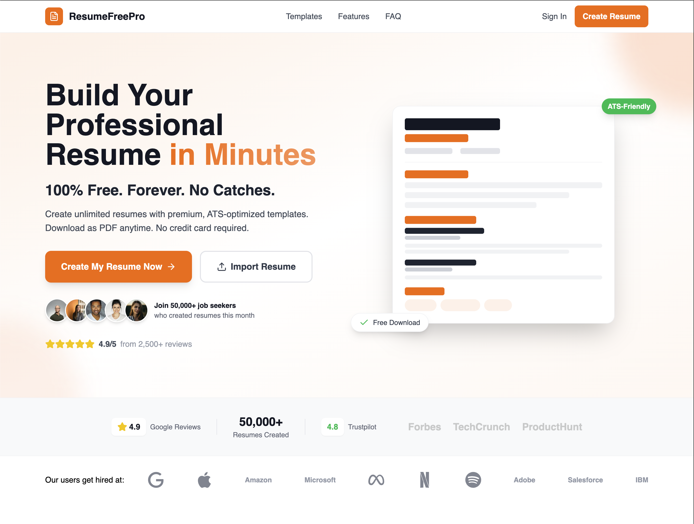
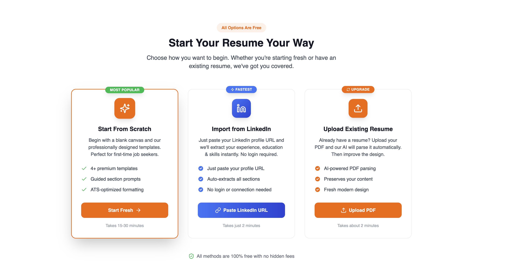
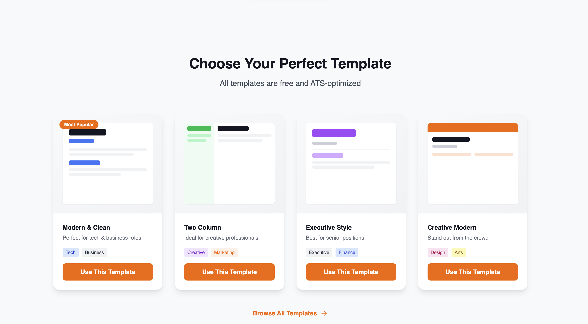
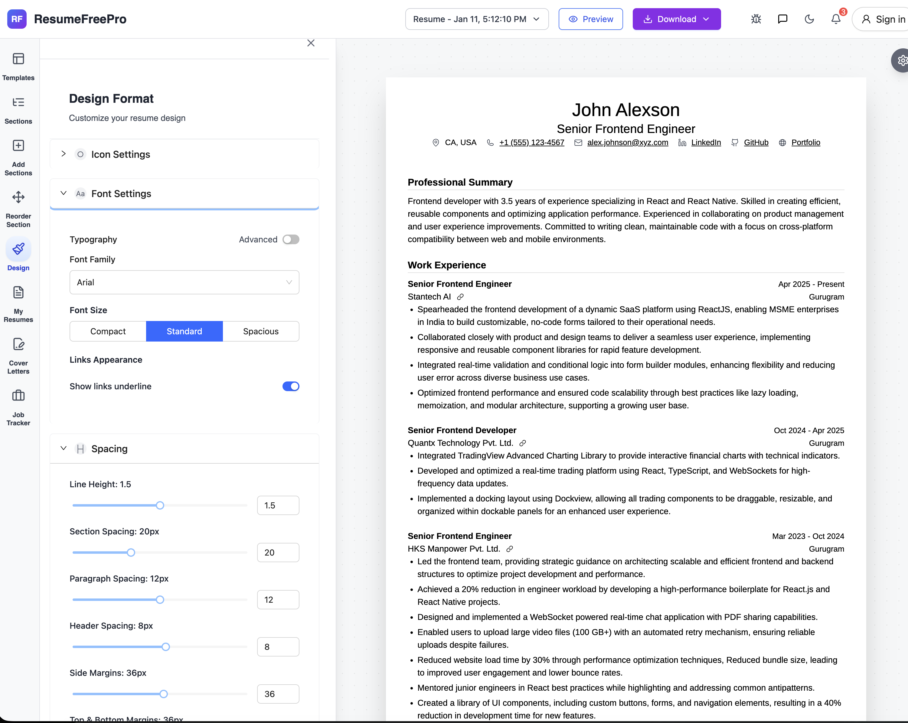
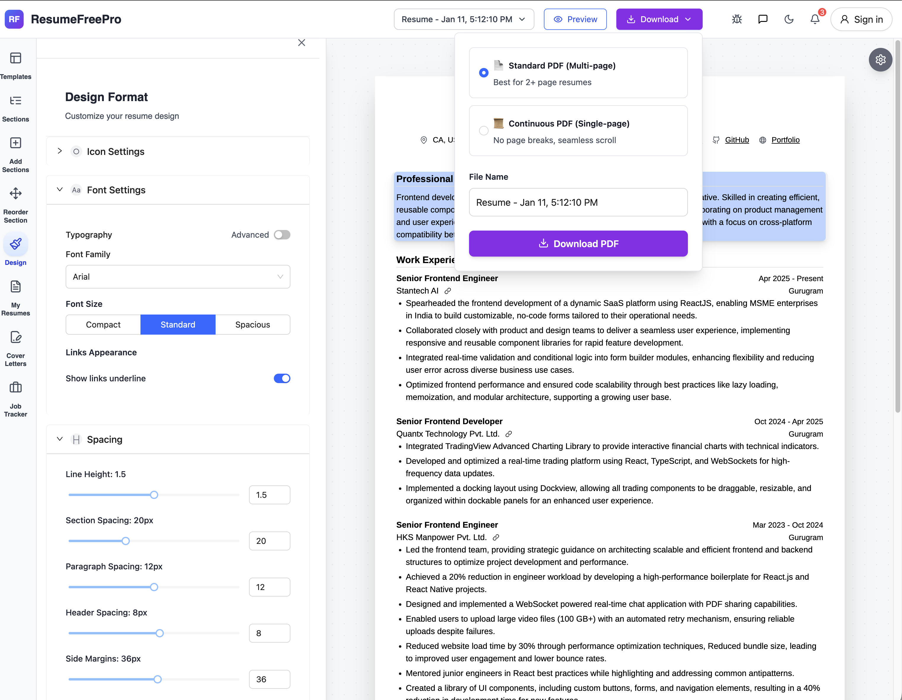

# ResumeFreePro

### Build Your Professional Resume in Minutes

**100% Free. Forever. No Catches.**

[**Try It Now**](https://www.resumefreepro.com) &bull; [**View Templates**](https://www.resumefreepro.com/#templates) &bull; [**Features**](https://www.resumefreepro.com/#features)

---

## Why ResumeFreePro?

| Feature | ResumeFreePro | Other Builders |
|---------|:-------------:|:--------------:|
| **Completely Free** | :white_check_mark: | :x: Paywalls |
| **No Watermarks** | :white_check_mark: | :x: Branding |
| **AI Resume Import** | :white_check_mark: | :x: Manual only |
| **LinkedIn Import** | :white_check_mark: | :x: Not available |
| **ATS Optimized** | :white_check_mark: | :warning: Sometimes |
| **Unlimited Downloads** | :white_check_mark: | :x: Limits |
| **No Sign-up Required** | :white_check_mark: | :x: Account needed |

---

## Features

### :rocket: AI-Powered Resume Import
Upload your existing PDF resume or paste your LinkedIn URL - our AI extracts all your information instantly.

### :art: Professional Templates
Choose from multiple ATS-optimized templates designed by HR professionals.

### :paintbrush: Deep Customization
Customize fonts, colors, spacing, icons, and layout to match your personal style.

### :page_facing_up: Multiple Download Options
Export your resume in different formats - seamless single-page or traditional multi-page PDF.

---

## How It Works

| Step 1 | Step 2 | Step 3 |
|:------:|:------:|:------:|
| :clipboard: **Choose Template** | :pencil2: **Fill Your Details** | :arrow_down: **Download PDF** |
| Pick from premium, ATS-optimized templates | Add your experience, skills, and education | Export your professional resume instantly |

---

## Quick Start

1. **Visit** [resumefreepro.com](https://www.resumefreepro.com)
2. **Click** "Create My Resume Now"
3. **Choose** a template or import existing resume
4. **Customize** your content and design
5. **Download** your PDF - done!

No sign-up required. No credit card needed. Free forever.

---

## Key Features

<table>
<tr>
<td width="33%" valign="top">

### :dollar: 100% Free Forever
No hidden fees, no credit card required, no watermarks. Create unlimited professional resumes completely free.

</td>
<td width="33%" valign="top">

### :white_check_mark: ATS-Optimized
All templates are designed to pass Applicant Tracking Systems. Get your resume seen by recruiters, not filtered out.

</td>
<td width="33%" valign="top">

### :arrow_down: Unlimited Downloads
Download your resume as a high-quality PDF as many times as you need. No limits, no restrictions.

</td>
</tr>
<tr>
<td width="33%" valign="top">

### :lock: Privacy First
Your data stays yours. We never sell or share your personal information with third parties. Period.

</td>
<td width="33%" valign="top">

### :page_facing_up: PDF Import
Already have a resume? Upload your existing PDF and our AI will parse it automatically. Edit and improve in seconds.

</td>
<td width="33%" valign="top">

### :briefcase: LinkedIn Import
Import your LinkedIn profile data with one click. Auto-fill your experience, education, and skills instantly.

</td>
</tr>
</table>

---

## Tech Stack

| Layer | Technologies |
|-------|-------------|
| **Frontend** | React 18, Vite, TypeScript, Tailwind CSS, Redux Toolkit |
| **Backend** | NestJS, MongoDB |
| **AI** | Grok for resume parsing | Gemini for the suggestions | GPT for the review|
| **Infrastructure** | Cloudflare Workers, Vercel |

---

## What Users Say

> *"I was skeptical about 'free' but ResumeFreePro delivered. Got 3 interview calls in my first week using my new resume!"*
>
> — **Sarah Mitchell**, Marketing Manager

> *"Best free resume builder I've tried. No hidden paywalls, no watermarks. Actually free! The templates are professional and modern."*
>
> — **James Kim**, Software Developer

> *"The PDF import feature saved me hours. Imported my old resume and made it look 10x better. Highly recommended!"*
>
> — **Michael Chen**, Product Manager

---

## Roadmap

- [x] AI PDF Import
- [x] LinkedIn Import
- [x] 4+ Professional Templates
- [x] Full Design Customization
- [x] Real-time PDF Preview
- [ ] Cover Letter Builder
- [ ] Job Application Tracker
- [ ] Chrome Extension
- [ ] Resume Analytics

---

## Contributing

We welcome contributions! See [CONTRIBUTING.md](CONTRIBUTING.md) for guidelines.

**Ways to contribute:**
- :bug: Report bugs
- :bulb: Suggest features
- :art: Submit template designs
- :globe_with_meridians: Add translations
- :book: Improve documentation

---

## Support

- :star: **Star this repo** if you find it useful
- :speech_balloon: [Open an issue](https://github.com/abhay-rana/resume-builder/issues) for bugs or feature requests
- :bird: Follow updates on [Twitter](https://twitter.com/abhayrana)

---

## License

MIT License - see [LICENSE](LICENSE) for details.

---

### Ready to Land Your Dream Job?

Create your professional resume in minutes. 100% free, no credit card required.

[**Create My Resume Now :arrow_right:**](https://www.resumefreepro.com)

---

Made with :heart: by [Abhay Rana](https://github.com/abhay-rana)

**[resumefreepro.com](https://www.resumefreepro.com)**

